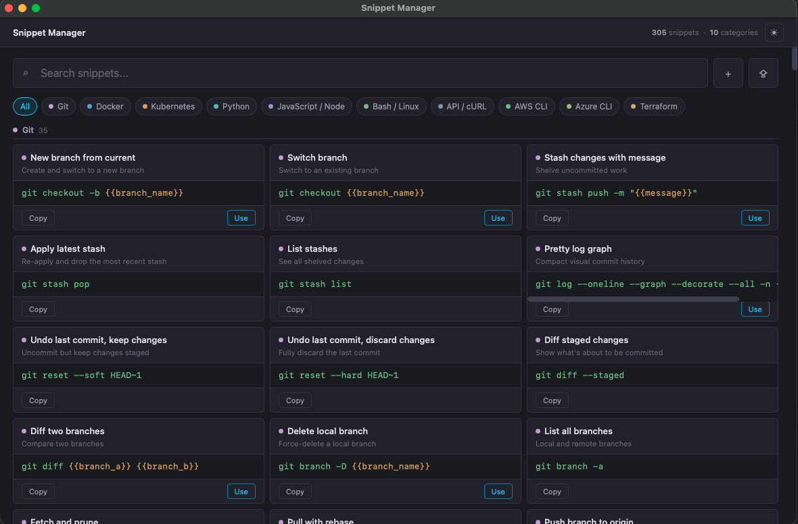

# Snippet Manager

A standalone, native-window snippet vault. Paste a command, get it back with
one click — no browser tab, no terminal, own local data file.



## Download (recommended)

Grab the build for your OS from the [Releases page](../../releases) —
double-click and go, no Python install required.

- **macOS**: unzip, then see [First launch on macOS](#first-launch-on-macos) below.
- **Windows**: unzip, run `Snippet Manager.exe`, see [First launch on Windows](#first-launch-on-windows).
- **Linux**: unzip, `chmod +x "Snippet Manager"`, run it. See [First launch on Linux](#first-launch-on-linux) below — most systems need one extra package install first.

### First launch on macOS

macOS Gatekeeper blocks apps from unidentified developers by default (this
app isn't code-signed/notarized). To open it the first time:

1. Right-click (or Control-click) `Snippet Manager.app` → **Open**.
2. Click **Open** again in the dialog that appears.

After that first approval, it opens normally with a regular double-click.

### First launch on Windows

Windows SmartScreen will warn about an "unrecognized app" since this isn't
signed with a paid code-signing certificate. To run it:

1. Click **More info** on the SmartScreen dialog.
2. Click **Run anyway**.

This is expected for unsigned open-source tools — you're not doing anything wrong.

### First launch on Linux

The app opens a native window using your system's GTK/WebKit libraries —
PyInstaller can't bundle those (they're OS-level shared libraries, not
Python packages), so most systems need them installed once. If you see:

```
webview.errors.WebViewException: You must have either QT or GTK with Python
extensions installed in order to use pywebview
```

install the GTK bindings:

```
sudo apt update
sudo apt install -y python3-gi python3-gi-cairo gir1.2-gtk-3.0 \
  gir1.2-webkit2-4.1 libgtk-3-0 libwebkit2gtk-4.1-0
```

On older distros where `gir1.2-webkit2-4.1` / `libwebkit2gtk-4.1-0` aren't
found, use the `-4.0` versions of both instead. Then run it again — no
reinstall of the app itself needed.

## Running from source

Requires Python 3.10+.

```
python3 -m venv .venv
source .venv/bin/activate      # .venv\Scripts\activate on Windows
pip install -r requirements.txt
python snippet_manager_app.py
```

First run seeds ~290 starter snippets (Git, Docker, Kubernetes, Python,
JavaScript/Node, Bash/Linux, API/cURL, AWS CLI, Azure CLI) into your own
data file — nothing shared with any other app. Categories aren't a fixed
list — adding or importing a snippet in a new category (e.g. "Terraform")
just creates it.

Data lives at:
- macOS: `~/Library/Application Support/Snippet Manager/snippets.yaml`
- Windows: `%APPDATA%\Snippet Manager\snippets.yaml`
- Linux: `$XDG_DATA_HOME/snippet-manager/snippets.yaml` (usually `~/.local/share/snippet-manager/`)
- Running from source (unpackaged): `./data/snippets.yaml` next to the code

Override with the `SNIPPET_MANAGER_DATA_FILE` env var if you want it elsewhere.

## Building the packaged app yourself

```
pip install -r requirements-build.txt
python build.py
```

Output lands in `dist/`. `build.py` picks sane defaults per OS (macOS:
`--onedir`, i.e. a proper `.app`; Windows/Linux: `--onefile`) — override with
`PYI_MODE=onefile` or `PYI_MODE=onedir` to compare startup time on your
platform.

PyInstaller does not cross-compile: a Windows build has to run on Windows, a
macOS build on macOS, a Linux build on Linux. `.github/workflows/build.yml`
runs the build natively on all three via a GitHub Actions matrix
(`macos-latest`, `windows-latest`, `ubuntu-latest`) on every push to `main`
and every `v*` tag, and attaches the three zipped artifacts to a GitHub
Release when you push a tag like `v1.0.0`.

## Adding snippets

**Quick single add** — click **+** (or press `N`), paste a command as you'd
actually type it in a terminal (no manual `{{}}` markup needed). It does a
light best-guess at which tokens are variables — a token right after a flag
like `-n`/`--namespace` — nothing fancier than that. You get a preview before
anything is saved: an editable title (left blank on purpose if there's no
good guess — never defaults to the raw command text), category, and the
command with guessed variables shown as clickable chips. Click a chip to
turn it back into literal text, or click any plain word to mark it as a
variable instead. Nothing is saved until you confirm.

**Bulk import** — click the **⇪** button next to **+** for library-quality,
many-at-once additions. Click **Copy AI prompt** in that dialog, paste it
into any AI assistant along with your commands (or just ask it for "15
common Terraform commands" with no commands of your own), then paste the
JSON reply back into the same dialog — or upload a `.json` file matching
the same shape, for sharing a pre-made snippet pack. Either way you get the
same reviewable list before anything is saved: one row per snippet,
editable, with an include/exclude toggle. Rows that are missing a required
field, or that exactly match something you've already saved, are flagged
inline and excluded by default — nothing gets silently duplicated or
dropped.

## Keyboard shortcuts

- `/` — focus search
- `N` — open the quick-add bar
- `+` button next to search — same as `N`
- `⇪` button next to search — open Import
- `Ctrl/Cmd + Enter` in the review dialog — save
- `Enter` in the "use" dialog — copy resolved command
- `Esc` — close any open dialog

## Theme

Click the sun/moon icon top-right to switch between dark and a light
"off-white + lilac" theme. Your choice is remembered across restarts.

## Running tests

```
pip install -r requirements-test.txt
pytest tests/ -v                  # backend: routes, category/dedup logic, seed data
node --test tests/*.test.js       # frontend: variable-guessing, escaping, category detection
```

Both suites run in CI (`.github/workflows/test.yml`) on every push and PR.

The Python suite includes a real concurrency regression test: it fires 20+
simultaneous writes at the API with a thread pool and asserts the resulting
YAML is still valid with no lost or duplicated snippets. That's not a
hypothetical — an earlier version of the bulk-save path (one `POST` per
snippet, fired in parallel) corrupted a real data file mid-write; the fix
(a single atomic batch write, guarded by a lock) is what this test locks in
place.

Business logic that doesn't need a browser (escaping, category detection,
the "+" quick-add variable guesser, JSON-import parsing) lives in
`ui/logic.js` — a small dependency-free module loaded as a plain
`<script>` tag by the app and as a CommonJS module by the tests, so it's
unit-testable in plain Node with no DOM shim or build step.

## License

[MIT](LICENSE)
